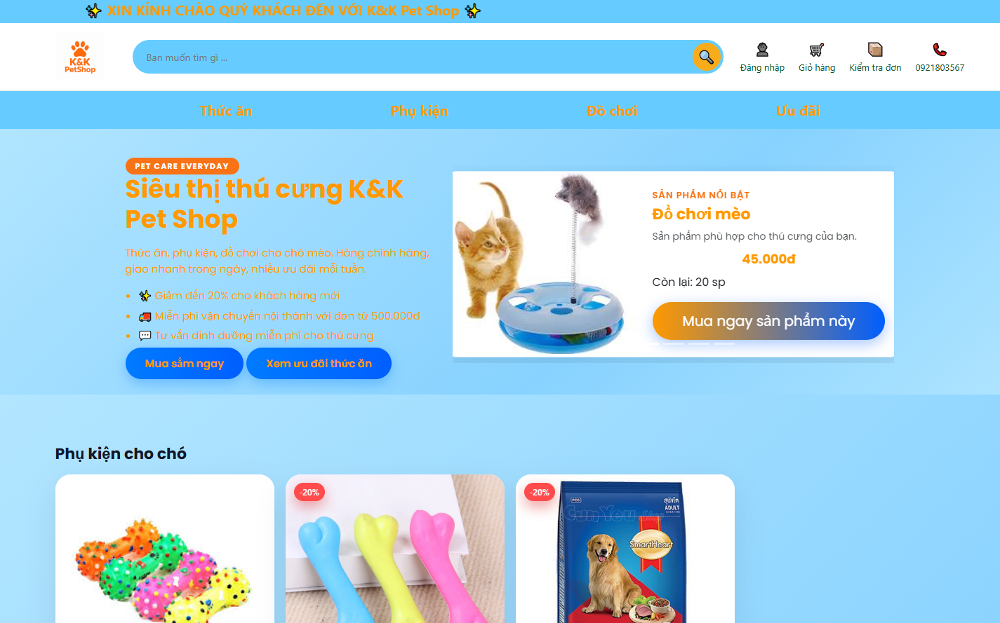
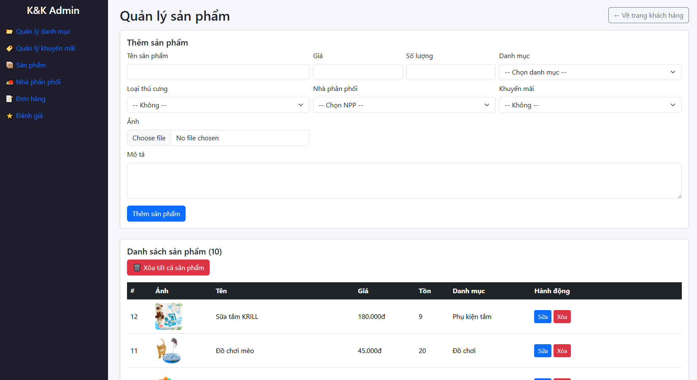

# K&K Pet Shop Management System

Hệ thống quản lý cửa hàng thú cưng trực tuyến được xây dựng bằng **PHP** & **MySQL**. Dự án bao gồm giao diện người dùng (trang chủ, sản phẩm, giỏ hàng, thanh toán) và panel quản trị (admin) để quản lý sản phẩm, đơn hàng, danh mục, khuyến mãi, đánh giá, nhà cung cấp...

Dự án này được phát triển để học tập và làm portfolio xin thực tập (internship) vị trí PHP Developer / Full-stack Web Developer.
Vì trường chỉ quan tâm về kiến thức nên giao diện web nhìn sẽ không được nổi bật ạ 



## Công nghệ sử dụng
- **Backend**: PHP 8+
- **Database**: MySQL
- **Frontend**: HTML5, CSS3, JavaScript (có thể dùng Bootstrap hoặc CSS thuần)
- **Server local**: XAMPP / WAMP
- **Deployment**: InfinityFree (free hosting với PHP + MySQL)

## Tính năng chính
### Phía người dùng (Frontend)
- Xem danh sách sản phẩm thú cưng (theo danh mục)
- Tìm kiếm sản phẩm
- Thêm vào giỏ hàng
- Xem giỏ hàng & cập nhật số lượng
- Thanh toán (checkout) – ghi nhận đơn hàng
- Trang chủ với banner & sản phẩm nổi bật

### Phía Admin (Backend)
- Đăng nhập / Đăng xuất admin
- Quản lý danh mục (categories)
- Quản lý sản phẩm (thêm/sửa/xóa, upload ảnh)
- Quản lý đơn hàng (orders)
- Quản lý khuyến mãi (promos)
- Quản lý đánh giá (reviews)
- Quản lý nhà cung cấp / nhà phân phối (vendors)

## Demo Online
🔗 **Live Demo**:  KKpetshop.infinityfree.me  

**Lưu ý**: Vì dùng hosting miễn phí (InfinityFree), trang có thể sleep sau 30 phút không hoạt động → refresh 1–2 lần nếu không load.  
Admin panel:  KKpetshop.infinityfree.me/admin.php  
Tài khoản test:  
- Username: admin@example.com  
- Password: 123456 

## Cài đặt & Chạy local (XAMPP)
1. Cài đặt **XAMPP**[](https://www.apachefriends.org/) → Start Apache + MySQL.
2. Copy toàn bộ thư mục dự án vào folder `htdocs` (ví dụ: `C:\xampp\htdocs\k-and-k-petshop`).
3. Mở **phpMyAdmin**[](http://localhost/phpmyadmin).
4. Tạo database mới tên `petshop` (hoặc tên bạn dùng).
5. Chọn database → tab **Import** → Choose file `database/db.sql` → Go để import cấu trúc bảng + dữ liệu mẫu.
6. Chỉnh file kết nối database (thường là `config.php` hoặc `db_connect.php`):
   ```php
   $host     = 'localhost';
   $username = 'root';
   $password = '';          // mặc định XAMPP là rỗng
   $database = 'petshop';
